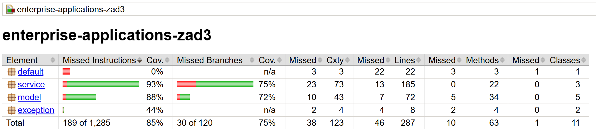

# HOW TO RUN?

## Run main test:
```java
mvn clean test-compile exec:java
``` 

## Run Spring Boot application:
```java
mvn -f pom.xml spring-boot:run
```

## Run Unit tests:
```java
mvn -f pom.xml test
```

## Run tests with code coverage:
```java
mvn verify
```

## TO RUN THE APPLICATION:
```java
mvn clean compile exec:java
```
> shows CSV import, salary consistency check, company statistics: employee count, avgSalary, highest paid employee

### expected output:
```java
=== CSV Import ===
ImportSummary{importedCount=6, errors=[Line 5: invalid position 'INVALID_POSITION', Line 6: invalid salary '-5000.0', Line 7: invalid salary 'abc']}

=== Fetch from API ===
Imported from API: 10

=== Salary consistency check ===
Canna Nowak | canna.nowak@example.com | DataSoft | PREZES | 23000.00
Ubogi Kamiński | ubogi.kaminski@example.com | TechCorp | PROGRAMISTA | 2000.00

=== Company statistics ===
Johns Group -> CompanyStatistics{employeeCount=1, averageSalary=8000.00, highestPaid='Kurtis Weissnat'}
Yost and Sons -> CompanyStatistics{employeeCount=1, averageSalary=8000.00, highestPaid='Glenna Reichert'}
TechCorp -> CompanyStatistics{employeeCount=3, averageSalary=10333.33, highestPaid='Wojtek Kamiński'}
Hoeger LLC -> CompanyStatistics{employeeCount=1, averageSalary=8000.00, highestPaid='Clementina DuBuque'}
Keebler LLC -> CompanyStatistics{employeeCount=1, averageSalary=8000.00, highestPaid='Chelsey Dietrich'}
DataSoft -> CompanyStatistics{employeeCount=3, averageSalary=16666.67, highestPaid='Canna Nowak'}
Romaguera-Crona -> CompanyStatistics{employeeCount=1, averageSalary=8000.00, highestPaid='Leanne Graham'}
Abernathy Group -> CompanyStatistics{employeeCount=1, averageSalary=8000.00, highestPaid='Nicholas Runolfsdottir V'}
Robel-Corkery -> CompanyStatistics{employeeCount=1, averageSalary=8000.00, highestPaid='Patricia Lebsack'}
Deckow-Crist -> CompanyStatistics{employeeCount=1, averageSalary=8000.00, highestPaid='Ervin Howell'}
Romaguera-Jacobson -> CompanyStatistics{employeeCount=1, averageSalary=8000.00, highestPaid='Clementine Bauch'}
Considine-Lockman -> CompanyStatistics{employeeCount=1, averageSalary=8000.00, highestPaid='Mrs. Dennis Schulist'}
------------------------------------------------------------------------
BUILD SUCCESS
------------------------------------------------------------------------
```


## RUN TESTS ONLY:
```java
mvn test
```
> runs additional tests skipped in main

### expected output:
```java
-------------------------------------------------------
  T E S T S
-------------------------------------------------------
Running model.ImportSummaryTest
Tests run: 1, Failures: 0, Errors: 0, Skipped: 0, Time elapsed: 0.039 s -- in model.ImportSummaryTest
Running model.EmployeeTest
Tests run: 3, Failures: 0, Errors: 0, Skipped: 0, Time elapsed: 0.018 s -- in model.EmployeeTest
Running model.PositionTest
Tests run: 2, Failures: 0, Errors: 0, Skipped: 0, Time elapsed: 0.003 s -- in model.PositionTest
Running model.CompanyTest
Tests run: 4, Failures: 0, Errors: 0, Skipped: 0, Time elapsed: 0.014 s -- in model.CompanyTest
Running service.ImportServiceTest
Tests run: 4, Failures: 0, Errors: 0, Skipped: 0, Time elapsed: 0.039 s -- in service.ImportServiceTest
Running service.ApiServiceTest
Tests run: 1, Failures: 0, Errors: 0, Skipped: 0, Time elapsed: 0.248 s -- in service.ApiServiceTest
Running service.ApiServiceHttpTest
Tests run: 10, Failures: 0, Errors: 0, Skipped: 0, Time elapsed: 0.248 s -- in service.ApiServiceHttpTest
Running service.EmployeeServiceTest
Tests run: 5, Failures: 0, Errors: 0, Skipped: 0, Time elapsed: 0.011 s -- in service.EmployeeServiceTest

Results:

Tests run: 30, Failures: 0, Errors: 0, Skipped: 0

------------------------------------------------------------------------
BUILD SUCCESS
------------------------------------------------------------------------
```

## RUN TESTS AND GENERATE COVERAGE REPORT:
```java
mvn verify
```
> runs all tests and generates coverage report in target/site/jacoco/index.html

### expected output:

image: 

## RUN FULL BUILD CYCLE WITH VERIFICATION:
```java
mvn clean verify
```
> cleans the target directory and runs all tests with verification

